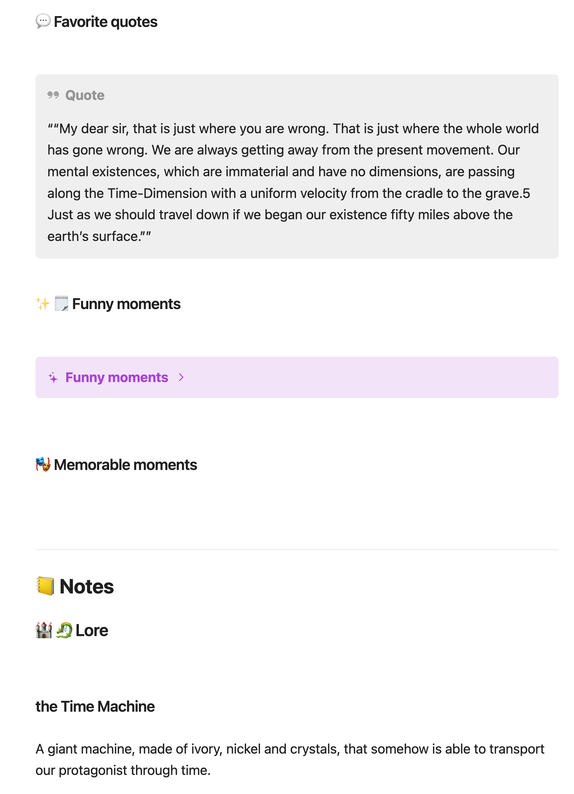

# KOReader to Obsidian Highlight Sync

A JavaScript automation script that syncs your KOReader highlights to Obsidian notes with intelligent categorization and formatting.

## 🚨 Important Disclaimer

**Always backup your Obsidian vault before using this script!** While the script is designed to be safe, it modifies your note files automatically, and data loss could occur if something goes wrong.

## 📖 What This Does

This project automates the tedious process of manually copying highlights from KOReader to your Obsidian book notes. Instead of manually organizing hundreds of highlights, this script:

- Automatically imports your latest KOReader highlights
- Categorizes them based on highlight colors (quotes, funny moments, important passages, etc.)
- Formats them properly in your Obsidian book notes
- Tracks your reading progress by chapter
- Maintains consistent note structure

## Example output



## 📋 Requirements

- **KOReader**
- **Obsidian**
- **Obsidian QuickAdd Plugin** - For running the sync script
- **KOReader Highlight Sync Plugin** - For exporting highlights as JSON

## 🛠️ Installation

### 1. Set up KOReader

1. Install the [KOReader Highlight Sync plugin](https://github.com/gitalexcampos/koreader-Highlight-Sync)
2. Place the plugin in your KOReader `plugins` folder
3. Make sure the "Highlightsync" plugin is enabled in KOReader settings (Top menu --> Tools --> Page 2 --> More tools --> Plugin management)

### 2. Install the Custom Highlight Menu (Recommended)

1. Copy `highlight-menu-modifications.lua` to your KOReader `patches` folder
2. Enable in KOReader settings (Top menu --> Tools --> Page 2 --> More tools --> Patch management)
3. This adds custom highlight buttons for different categories (Important, Funny, Quote, etc.)
4. **Credit**: Based on work by [@erildt](https://github.com/erildt) - customized for this workflow

### 3. Set up Obsidian

1. Install the **QuickAdd** plugin in Obsidian
2. Create a new QuickAdd action:
   - Type: Script
   - Name: "Sync KOReader Highlights"
   - Script file: Point to `koreader-obsidian-sync.js`

### 4. Configure Paths

In the script, update the `KOReaderPath` variable to match where you store your highlight sync files:

```javascript
const KOReaderPath = "Books/KOReader_highlights"; // Adjust this path
```

### 5. Add the Book Template

Copy `Book.md` from the templates folder to your Obsidian templates folder. This provides the structured format that the script expects.

## 📚 How to Use

### Initial Setup for Each Book

1. Create a new note in Obsidian using the Book template
2. Fill in the book details in the frontmatter
3. Set `last-completed-chapter: started` in the frontmatter

### Reading and Highlighting

The custom highlight menu provides these options (**you don't need to memorize these - they're all automated!**):

- **Underline** (Gray) - Cosmetic only, not synced
- **Important** (Red) - Added to the relevant chapter section for later review
- **Funny** (Yellow) - Added to a "Funny moments" collapsible section
- **Quote** (Blue) - Added to the "Favorite quotes" section with proper quote formatting
- **Lore** (Olive) - Added to the "Lore" section with the highlight text as heading
- **Character** (Cyan) - Added to the "Characters" section with the highlight text as heading  
- **Memorable** (Orange) - Added to the "Memorable moments" section

### Syncing to Obsidian

1. In KOReader, export your highlights using the Highlight Sync plugin
2. Place the exported JSON file in your `KOReader_highlights` folder
3. In Obsidian, run the QuickAdd command "Sync KOReader Highlights"
4. The script will find the most recent highlight file and ask for confirmation
5. After processing, you can choose to delete the highlight file

### Tracking Reading Progress

Update the `last-completed-chapter` field in your book's frontmatter as you read. The script will only process new chapters, avoiding duplicate imports.

Special values:

- `started` - Process all chapters
- `completed` - Skip all processing
- `Chapter Name` - Process only chapters after this one

## 🔧 File Structure

Your Obsidian vault should look like this:

```
vault/
├── Books/
│   ├── KOReader_highlights/    # Highlight sync files go here
│   └── [Your book notes].md
├── templates/
│   └── Book.md                 # Book template
└── scripts/
    └── koreader-obsidian-sync.js
```

## 🎯 Example Workflow

1. Reading "The Hobbit" on KOReader
2. Highlight important dialogue with the "Important" button
3. Highlight memorable quotes with the "Quote" button
4. Export highlights from KOReader
5. Place the exported JSON file in `Books/KOReader_highlights`
6. Run sync script in Obsidian
7. Your book note now has organized sections with all highlights properly formatted

## 🚧 Known Limitations

- This is a basic script created for personal use - expect some rough edges
- Limited error handling for edge cases
- Only works with the specific note template provided
- Requires manual chapter progress tracking

## 🤝 Contributing

I'm very new to JavaScript and built this primarily for my own reading workflow. Contributions are absolutely welcome! Feel free to:

- Report bugs
- Suggest improvements
- Submit pull requests
- Share your modifications

## 📝 Troubleshooting

### Common Issues

**Script can't find highlight files:**

- Check that `KOReaderPath` matches your actual folder structure
- Ensure highlight files are being exported to the correct location

**Highlights not appearing:**

- Verify your book note uses the correct template structure
- Check that section headings match what the script expects
- Make sure `last-completed-chapter` is set properly

**Script errors:**

- Backup your notes before running
- Check the Obsidian console for error details
- Try with a simple test note first

**Duplicate highlights:**

- The script tries to detect duplicates but isn't perfect
- You may need to manually clean up duplicates occasionally

### Getting Help

If you encounter issues:

1. Check that all requirements are properly installed
2. Verify your file paths and folder structure
3. Test with a simple book note first
4. Open an issue on GitHub with details about your setup

## 📄 License

MIT License (MIT)

## 🙏 Acknowledgments

- [@gitalexcampos](https://github.com/gitalexcampos) for the KOReader Highlight Sync plugin
- [@erildt](https://github.com/erildt) for the original highlight menu modifications
- The KOReader and Obsidian communities for inspiration

---

*Happy reading and note-taking!* 📚✨
